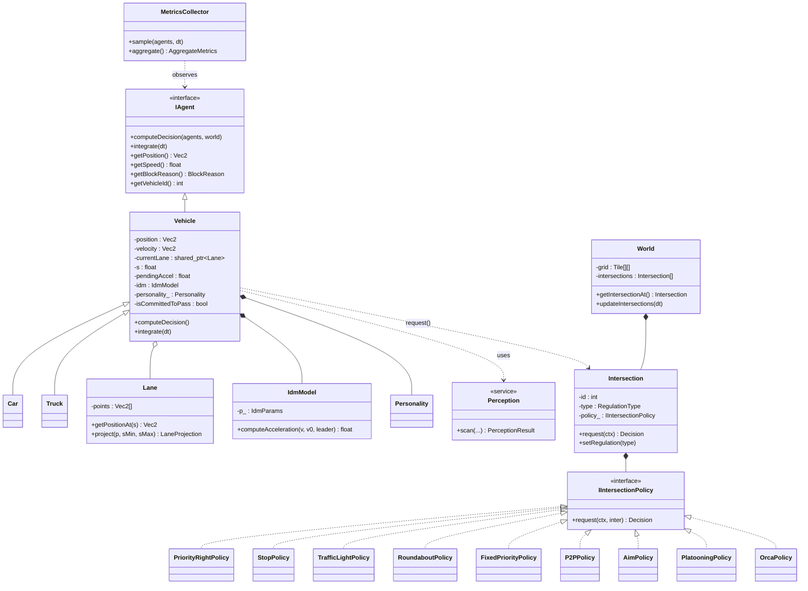

# 📐 PHASE 1 — RÉTRO-INGÉNIERIE, ARCHITECTURE & FLUX DE DONNÉES

> **Objectif global :** Refondre la logique d'une simulation de trafic multi-agents pour éradiquer les interblocages et bugs comportementaux (suivi fantôme, ronds-points bloqués, deadlocks), tout en produisant une documentation architecturale exhaustive destinée à des présentations vidéo.

---

## 1.1 Flux global de l'application (Main loop et update ticks)

### 1.1.1 Vue d'ensemble

L'application repose sur une **boucle SFML cadencée à 60 FPS** (`window.setFramerateLimit(60)`), pilotée par une machine à trois états :

| État | Rôle |
|---|---|
| `MAIN_MENU` | Sélection du scénario (catalogue ou édition vierge) |
| `MONTE_CARLO` | Banc d'essai quantitatif (visuel ou headless multi-thread) |
| `SIMULATION` | Exécution réelle de la simulation, rendu + dashboard |

### 1.1.2 Découplage rendu / logique : pas de temps fixe

Le point architectural **critique** : le solver de décision (IDM, policies) tourne sur un **pas de simulation FIXE** (`FIXED_DT = 1/60 s`), indépendant du framerate. Un accumulateur découple la cadence d'affichage du moteur logique.

```
boucle principale (60 FPS) :
    ├─ pollEvents()                     # ImGui + SFML, édition build mode, caméra
    ├─ frameTime = clock.restart() * simSpeedFactor
    ├─ simAccumulator += frameTime
    ├─ TANT QUE simAccumulator ≥ FIXED_DT ET steps < MAX_SUBSTEPS (=5) :
    │       │
    │       │  ┌──── TICK LOGIQUE (FIXED_DT = 16.67 ms) ────┐
    │       │  │ 1. mcLive.inject()           # Monte-Carlo spawn stochastique
    │       │  │ 2. world.updateIntersections(dt)  # feux, horloges policies
    │       │  │ 3. PHASE DÉCISION :
    │       │  │    pour chaque agent :
    │       │  │       agent.computeDecision(agents, world)   # LECTURE SEULE
    │       │  │    (parallélisable si N ≥ kParallelThreshold=150)
    │       │  │ 4. PHASE INTÉGRATION (séquentielle, déterministe) :
    │       │  │    pour chaque agent :
    │       │  │       agent.integrate(FIXED_DT)              # ÉCRITURE état
    │       │  │ 5. metrics.sample(agents, FIXED_DT)
    │       │  └────────────────────────────────────────────┘
    │       │
    │       └─ simAccumulator -= FIXED_DT
    ├─ destruction des agents AT_GOAL
    ├─ détection fin de simulation (anyActive ?)
    ├─ rendu : map, intersections, agents, overlays debug
    └─ rendu UI ImGui (dashboard, métriques, palette build)
```

### 1.1.3 Anti-spirale de la mort

Si `MAX_SUBSTEPS = 5` est atteint (5 sous-pas dans un même frame), l'accumulateur est purgé pour éviter qu'un freeze ne déclenche un sur-rattrapage logique qui ralentirait davantage.

### 1.1.4 Le pipeline en DEUX PHASES (point fondamental)

Le moteur respecte strictement le pattern **"compute then apply"** :

```
ÉTAT N           ─[ Phase 1 : DÉCISION ]→        ÉTAT N
(figé)             (lecture seule globale)         (inchangé)
                   produit : pendingAccel,
                             pendingDesiredSpeed
                                                  ↓
                                          ─[ Phase 2 : INTÉGRATION ]→  ÉTAT N+1
                                          (chaque agent écrit
                                           SES propres champs uniquement)
```

**Conséquences directes :**

- Tous les agents prennent leur décision vis-à-vis du *même* snapshot du monde. Aucun biais d'ordre.
- La Phase 1 est **trivialement parallélisable** (cf. `sim/ParallelDecisions.cpp`).
- Seul point de contention : la table de réservations AIM, protégée par un mutex *par intersection*.
- La Phase 2 reste séquentielle pour rester bit-déterministe (snapshot tests, Monte-Carlo).

---

## 1.2 Patron d'architecture retenu : **OOP polymorphe + Strategy + composition d'interfaces**

### 1.2.1 Comparatif et justification

| Patron | Forces | Faiblesses pour ce projet | Verdict |
|---|---|---|---|
| **ECS pur** (Unity DOTS-like) | Cache-friendly (SoA), parallélisation massive, scaling 10⁴+ agents | Coût d'entrée énorme, complexité accidentelle, mauvaise lisibilité pour règles métier complexes (priorité, P2P), perte d'introspection | ❌ Sur-dimensionné |
| **OOP plate** (héritage profond) | Mapping 1:1 au domaine | Couplage fort, explosion combinatoire (Vehicle × Personality × Policy), pas de pluggabilité | ❌ Risque god-class |
| **OOP + Strategy + Interfaces** ✅ | Découplage, swap d'algorithme à chaud, parallélisation safe par pipeline 2-phases, testabilité | Surcoût vtable négligeable | ✅ **Choix retenu** |

### 1.2.2 Justification fine pour le contexte SMA

Une simulation multi-agents impose **trois contraintes structurantes** :

1. **Hétérogénéité comportementale** — un véhicule normal, un camion, un agressif, un calme partagent le même solver IDM avec des paramètres différents. ➜ **Composition** d'un `ICarFollowingModel` + d'une `Personality` *dans* le `Vehicle`, plutôt qu'héritage multiple.

2. **Variabilité des règles d'intersection** — 9 politiques de régulation interchangeables sur la même géométrie. ➜ **Pattern Strategy** via `IIntersectionPolicy` injectée dans chaque `Intersection`.

3. **Parallélisation safe-by-construction** — la séparation Phase 1 / Phase 2 (lecture pure / écriture privée) garantit l'absence de course. ➜ Interface `IAgent` à contrat strict.

### 1.2.3 Découpage en couches (modules)

```
┌─────────────────────────────────────────────────────────────────────┐
│                         main.cpp (orchestration)                    │
│                  ImGui, SFML, AppState, FIXED_DT loop               │
└─────────────────────────────────────────────────────────────────────┘
        │                            │                       │
        ▼                            ▼                       ▼
┌──────────────────┐     ┌─────────────────────┐    ┌─────────────────┐
│   core/agent     │     │  core/intersection  │    │   core/world    │
│  IAgent          │     │  IIntersectionPolicy│    │  World          │
│  Vehicle / Car   │     │  + 9 policies       │    │  Lane           │
│  Personality     │     │  Intersection       │    │  Tile           │
└──────────────────┘     └─────────────────────┘    └─────────────────┘
        │                            │                       │
        └────────────┬───────────────┴───────────────────────┘
                     ▼
        ┌─────────────────────────────────┐
        │   core/behavior, core/perception │
        │   ICarFollowingModel (IDM)       │
        │   Perception (Frenet projection) │
        └─────────────────────────────────┘
                     │
        ┌────────────┴────────────┐
        ▼                         ▼
┌──────────────┐         ┌──────────────────┐
│  core/math   │         │   core/metrics   │
│  Vec2, Rng   │         │  Throughput, TTC │
└──────────────┘         └──────────────────┘
        │
        ▼
┌──────────────────────────────────────┐
│   sim/  (Spawner, ExperimentRunner,  │
│         ThreadPool, ParallelDecisions)│
└──────────────────────────────────────┘
        │
        ▼
┌──────────────────────────────────────┐
│   render/  (SfmlRenderer, Camera)    │
│   io/      (ScenarioIO, SceneBuilder)│
└──────────────────────────────────────┘
```

**Propriété clé :** `core/` est **100% SFML-free**. Le rendu vit dans `render/`. Cela permet le mode headless Monte-Carlo (banc d'essai sur un thread sans contexte graphique).

---

## 1.3 Localisation des informations et autorité décisionnelle

### 1.3.1 Où vivent les données ?

| Information | Propriétaire | Champ |
|---|---|---|
| Position monde (x, y px) | `Vehicle` | `core::Vec2 position` |
| Vitesse vectorielle | `Vehicle` | `core::Vec2 velocity` |
| Vitesse scalaire | `Vehicle` | `float currentSpeed` |
| Cap (heading) | `Vehicle` | `float currentAngle` (degrés) |
| Hitbox (bodySize) | `Vehicle` | `core::Vec2 bodySize` |
| Couleur | `Vehicle` | `core::Color bodyColor` |
| VIN (identité stable) | `Vehicle` | `int vehicleId_` |
| Trajectoire 1D | `Vehicle` | `std::shared_ptr<Lane> currentLane` |
| Abscisse curviligne | `Vehicle` | `float s` (le long de la Lane) |
| Paramètres IDM | `Vehicle` | `core::behavior::IdmModel idm` |
| Personnalité | `Vehicle` | `core::agent::Personality personality_` |
| Topologie route | `World` | `std::vector<std::vector<Tile>> grid` + `intersections` |
| Géométrie + type intersection | `Intersection` | `coveredTiles`, `approaches`, `RegulationType` |
| Algorithme de régulation | `Intersection` | `std::unique_ptr<IIntersectionPolicy> policy_` |
| État feux | `Intersection` | `lightTimer`, `currentPhase` |
| Réservations AIM | `AimPolicy` (interne) | Table protégée par `reqMutex_` |
| Snapshot debug | `Vehicle` | `dbgLeaderSrc_`, `dbgLeaderVin_`, `dbgLeaderRelHeadingDeg_`, … |

### 1.3.2 Qui décide ? Le modèle **"Agent autonome + Oracle passif"**

Le projet a fait le choix architectural **fort** d'un **agent autonome décentralisé** :

```
            ┌─────────────────────────────────────────────────┐
            │           AGENT (Vehicle) — décideur            │
            │                                                 │
            │  computeDecision(agents, world) :               │
            │    1. Perception::scan(...)  ────────►  PERCEPTION (service stateless)
            │    2. interroge IDM           ────────►  CAR-FOLLOWING (service stateless)
            │    3. interroge Intersection  ────────►  POLICY (Strategy, oracle passif)
            │    4. fusionne les leaders virtuels
            │    5. produit pendingAccel + pendingDesiredSpeed│
            │                                                 │
            │  integrate(dt) :                                │
            │    Euler symplectique + mise à jour s, position │
            └─────────────────────────────────────────────────┘
                            │
                            │  REQUEST (PolicyContext)
                            ▼
            ┌─────────────────────────────────────────────────┐
            │   Intersection (composite : geom + policy)      │
            │                                                 │
            │   policy_->request(ctx, *this)  ─►  Decision    │
            │     ┌──────────────────────────────────────┐    │
            │     │ canEnter, shouldStop, stopLineGap,   │    │
            │     │ followVirtualLeader, virtualLeader…  │    │
            │     └──────────────────────────────────────┘    │
            │                                                 │
            │   ➤ ne pousse RIEN à l'agent : oracle passif    │
            │   ➤ ne stocke que son propre état (feux, AIM)   │
            └─────────────────────────────────────────────────┘
```

**Trois propriétés capitales :**

1. **L'intersection n'est jamais en position d'autorité directive.** Elle répond à `request()`, ne commande pas. C'est exactement le principe de la **gap acceptance** en ingénierie du trafic réelle.

2. **L'agent fusionne plusieurs sources de contrainte** dans son IDM : leader réel + leader virtuel "stop-line" + leader virtuel mobile (peloton). Règle de fusion = **le plus contraignant l'emporte** (plus petit gap → freinage le plus fort).

3. **Aucun manager global** ne tient une liste de "qui passe à qui". Seule exception : `AimPolicy`, centralisée *par carrefour* mais pas globalement.

---

## 1.4 Diagramme de classes complet (PlantUML)

```plantuml
@startuml TrafficSimulation_ClassDiagram
!theme plain
skinparam classAttributeIconSize 0
skinparam linetype ortho

' ========================================================================
'  COUCHE 1 : INTERFACES & TYPES FONDAMENTAUX
' ========================================================================
package "core::math" {
    class Vec2 {
        +float x
        +float y
    }
    class TileCoord {
        +int x
        +int y
    }
    class Rng {
        -uint64_t state
        +uniform(lo, hi) : float
        +gaussian(mu, sigma) : float
    }
}

package "core::agent" {
    enum BlockReason {
        NONE
        NO_PATH
        AT_GOAL
        INITIALIZING
        CORNERING
        LEADER_VEHICLE
        INTERSECTION_RED
        INTERSECTION_YIELD
        INTERSECTION_STOP
        NEGOTIATING
        PLATOONING
        BREAKDOWN
        OVERTAKING
        KEEP_CLEAR
    }
    enum TurnIntent {
        UNKNOWN
        STRAIGHT
        LEFT
        RIGHT
    }
    class Personality {
        +float aggressiveness
        +float patience
        +float lawAbidance
        +clamp()
    }

    interface IAgent {
        +{abstract} computeDecision(agents, world)
        +{abstract} integrate(dt)
        +{abstract} getPosition() : Vec2
        +{abstract} getHeading() : float
        +{abstract} getSpeed() : float
        +{abstract} getLength() : float
        +{abstract} getBodySize() : Vec2
        +{abstract} getBlockReason() : BlockReason
        +getVehicleId() : int
        +getTurnIntent() : TurnIntent
        +getCurrentAccel() : float
    }

    class Vehicle {
        # position : Vec2
        # velocity : Vec2
        # currentSpeed : float
        # currentAngle : float
        # bodySize : Vec2
        # currentLane : shared_ptr<Lane>
        # s : float
        # pendingAccel : float
        # pendingDesiredSpeed : float
        # idm : IdmModel
        # personality_ : Personality
        # isCommittedToPass : bool
        # committedIntersectionId : int
        # overtakeState : OvertakeState
        # lateralOffset : float
        # currentBlockReason : BlockReason
        # vehicleId_ : int
        + computeDecision(agents, world)
        + integrate(dt)
        + recalculatePath(world)
        + setPath(tilePath, world)
        - rebuildLaneFromPath()
        - tryStartOvertake()
        - updateOvertakeDecision()
        - updateOvertakeMotion(dt)
        - applyPersonalityToIdm()
    }
    class Car
    class Truck
}

package "core::behavior" {
    interface ICarFollowingModel {
        +{abstract} computeAcceleration(selfSpeed, desiredSpeed, leader) : float
    }
    class IdmModel {
        - p_ : IdmParams
        + computeAcceleration(...)
    }
    class IdmParams {
        +float T
        +float s0
        +float aMax
        +float bComf
        +float delta
    }
    class LeaderInfo {
        +bool hasLeader
        +float gap
        +float speed
    }
}

package "core::perception" {
    class VisionParams {
        +float range
        +float halfAngleDeg
        +float intersectionLookAhead
        +float laneCorridorHalf
    }
    class DetectedObject {
        +const IAgent* agent
        +DetectedType type
        +float distance
        +float relativeAngle
    }
    class PerceptionResult {
        +vector<DetectedObject> detected
        +bool hasDirectObstacle
        +float directObstacleDistance
        +float directObstacleSpeed
        +const IAgent* directObstacleAgent
        +bool approachingIntersection
    }
    class Perception <<service>> {
        +{static} scan(pos, heading, self, agents, world, params, lane, s) : PerceptionResult
    }
}

' ========================================================================
'  COUCHE 2 : MONDE ET TOPOLOGIE
' ========================================================================
package "core::world" {
    enum RoadType {
        NONE
        CITY_30
        CITY_50
        ROAD_80
        HIGHWAY_130
        INTERSECTION
    }
    enum TileDirection { NONE  UP  DOWN  LEFT  RIGHT }

    class Tile {
        +RoadType roadType
        +TileDirection direction
    }
    class LaneProjection {
        +bool valid
        +float s
        +float lateral
    }
    class Lane {
        - points : vector<Vec2>
        - accumulatedDistances : vector<float>
        - totalLength : float
        + getPositionAt(s) : Vec2
        + getHeadingAt(s) : float
        + project(p, sMin, sMax) : LaneProjection
    }

    class World {
        - gridWidth : int
        - gridHeight : int
        - tileSize : float
        - grid : vector<vector<Tile>>
        - intersections : vector<Intersection>
        + setTile(x, y, type, dir)
        + getTile(x, y) : Tile&
        + updateIntersections(dt)
        + getIntersectionAt(x, y) : Intersection*
        + setIntersectionRegulation(idx, type)
        + refreshRoundaboutApproaches()
    }
}

' ========================================================================
'  COUCHE 3 : INTERSECTIONS ET POLICIES (Strategy Pattern)
' ========================================================================
package "core::intersection" {
    enum RegulationType {
        PRIORITY_RIGHT
        STOP
        YIELD
        TRAFFIC_LIGHT
        ROUNDABOUT
        FIXED_PRIORITY
        P2P
        AIM
        VIRTUAL_PLATOON
        ORCA
    }
    enum LightState { GREEN  ORANGE  RED }
    class Approach {
        +Direction direction
        +TileCoord entryTile
        +bool hasGreen
    }
    class Decision {
        +bool canEnter
        +bool shouldStop
        +float stopLineGap
        +float yieldUntilT
        +bool followVirtualLeader
        +float virtualLeaderGap
        +float virtualLeaderSpeed
    }
    class PolicyContext {
        +AgentContext self
        +const IAgent* selfAgent
        +float tileSize
        +const vector<IAgent*>* others
    }

    class Intersection {
        - id : int
        - type : RegulationType
        - coveredTiles : vector<TileCoord>
        - approaches : vector<Approach>
        - lightTimer : float
        - currentPhase : int
        - clock_ : float
        - policy_ : unique_ptr<IIntersectionPolicy>
        - reqMutex_ : unique_ptr<mutex>
        + request(ctx) : Decision
        + setRegulation(type)
        + update(dt)
        + getWorldCenter(tileSize) : Vec2
        + getOuterRadius(tileSize) : float
    }

    interface IIntersectionPolicy {
        +{abstract} request(ctx, inter) : Decision
    }

    class PriorityRightPolicy
    class StopPolicy
    class TrafficLightPolicy
    class RoundaboutPolicy
    class FixedPriorityPolicy
    class P2PPolicy {
        + stateFor(ctx, inter) : P2PState
    }
    class AimPolicy {
        - reservations_ : table  <<protected by Intersection::reqMutex_>>
    }
    class PlatooningPolicy
    class OrcaPolicy
}

' ========================================================================
'  COUCHE 4 : SIMULATION & ORCHESTRATION
' ========================================================================
package "sim" {
    class ThreadPool {
        - workers : vector<thread>
        + parallelism() : unsigned
        + dispatch(jobs)
    }
    class SpawnProfile {
        +float wCar, wTruck
        +float wNormal, wAggressive, wCalm
        +bool  gaussianHeterogeneity
        +float driverSigma
    }
    class Spawner {
        +{static} spawnVehicle(profile, rng, ...)
    }
    class McLiveSession {
        + start(world, agents, strat, density, profile, seed, budget, tLimit, side)
        + inject(world, agents, dt)
        + stop()
        + active() : bool
    }
    class ExperimentConfig {
        +float durationSec
        +int runsPerPoint
        +SpawnProfile spawn
        +int roundaboutSide
        +vector<RegulationType> strategies
    }
    class ResultRow {
        +RegulationType strategy
        +float density
        +float throughputPerMin
        +float meanDelaySec
        +float minTTC
    }
    class ExperimentRunner <<static>> {
        +{static} run(cfg, *progress) : vector<ResultRow>
        +{static} exportCsv(path, rows)
        +{static} strategyName(s) : const char*
    }
    class ParallelDecisions <<service>> {
        +{static} computeDecisionsParallel(agents, world, pool)
    }
}

' ========================================================================
'  COUCHE 5 : METRIQUES, RENDU, I/O
' ========================================================================
package "core::metrics" {
    class AggregateMetrics {
        +int activeVehicles, completedVehicles
        +float throughputPerMin
        +float meanDelaySec
        +float meanSpeed
        +float minTTC
        +int ttcViolations
        +int totalStops
        +float meanJerkCompleted
        +float simTime
    }
    class MetricsCollector {
        - agents_ : map<int, PerAgent>
        - agg_ : AggregateMetrics
        - completionTimes_ : vector<float>
        - histThroughput_, histDelay_, histSpeed_, histMinTTC_
        + reset()
        + sample(agents, dt)
        + aggregate() : AggregateMetrics&
        + exportCsv(path) : bool
        + exportJson(path) : bool
    }
}

package "render" {
    interface IRenderer
    class SfmlRenderer
    class Camera
    class NullRenderer
}

package "io" {
    class SceneBuilder
    class ScenarioIO
    class ScenarioCatalog
}

' ========================================================================
'  RELATIONS
' ========================================================================
IAgent <|-- Vehicle
Vehicle <|-- Car
Vehicle <|-- Truck

Vehicle "1" o-- "1" Lane            : trajectoire 1D
Vehicle "1" *-- "1" IdmModel        : composition (CarFollowing)
Vehicle "1" *-- "1" Personality
Vehicle "1" *-- "1" Rng             : RNG par-agent
Vehicle ..> Perception              : appelle scan()
Vehicle ..> PerceptionResult        : consomme
Vehicle ..> Intersection            : appelle request()
Vehicle ..> Decision                : consomme

IdmModel ..|> ICarFollowingModel
IdmModel "1" *-- "1" IdmParams
IdmModel ..> LeaderInfo

World "1" *-- "*" Intersection
World "1" *-- "many" Tile           : grid
Tile ..> RoadType
Tile ..> TileDirection

Intersection "1" *-- "1" IIntersectionPolicy : Strategy
Intersection "1" *-- "*" Approach
PriorityRightPolicy   ..|> IIntersectionPolicy
StopPolicy            ..|> IIntersectionPolicy
TrafficLightPolicy    ..|> IIntersectionPolicy
RoundaboutPolicy      ..|> IIntersectionPolicy
FixedPriorityPolicy   ..|> IIntersectionPolicy
P2PPolicy             ..|> IIntersectionPolicy
AimPolicy             ..|> IIntersectionPolicy
PlatooningPolicy      ..|> IIntersectionPolicy
OrcaPolicy            ..|> IIntersectionPolicy

Intersection ..> Decision           : produit
Intersection ..> PolicyContext      : consomme

ParallelDecisions ..> ThreadPool    : dispatche
ParallelDecisions ..> IAgent        : invoque computeDecision

Spawner ..> Vehicle                 : construit
Spawner ..> SpawnProfile
McLiveSession ..> Spawner
ExperimentRunner ..> ExperimentConfig
ExperimentRunner ..> ResultRow
ExperimentRunner ..> World
ExperimentRunner ..> MetricsCollector

MetricsCollector ..> IAgent         : observe (sample)
MetricsCollector ..> AggregateMetrics

SfmlRenderer ..|> IRenderer
NullRenderer ..|> IRenderer
SfmlRenderer ..> World
SfmlRenderer ..> IAgent
SfmlRenderer ..> Camera

SceneBuilder ..> World
SceneBuilder ..> Vehicle
ScenarioIO   ..> World
ScenarioCatalog ..> SceneBuilder

@enduml
```

### 1.4.1 Vue compacte Mermaid (présentation rapide)



---

## 1.5 Synthèse Phase 1

| Question | Réponse |
|---|---|
| **Quel patron ?** | OOP + Strategy + composition d'interfaces |
| **Quel pas de temps ?** | `FIXED_DT = 1/60 s`, découplé via accumulateur, anti-spirale `MAX_SUBSTEPS=5` |
| **Quel pipeline ?** | Pipeline 2-phases strict : `computeDecision()` lecture seule → `integrate(dt)` écriture privée |
| **Où vit la donnée véhicule ?** | Dans `Vehicle` (composition : Lane + IDM + Personality + Rng) ; VIN stable pour identité + métriques |
| **Qui décide ?** | L'agent (autonome). L'`Intersection` est un **oracle passif** qui répond à `request()` |
| **Swap d'algo ?** | `Intersection::setRegulation(type)` recrée la policy in-place |
| **Couches** | `core/` SFML-free ↔ `render/` SFML ↔ `sim/` orchestration ↔ `io/` persistance |
