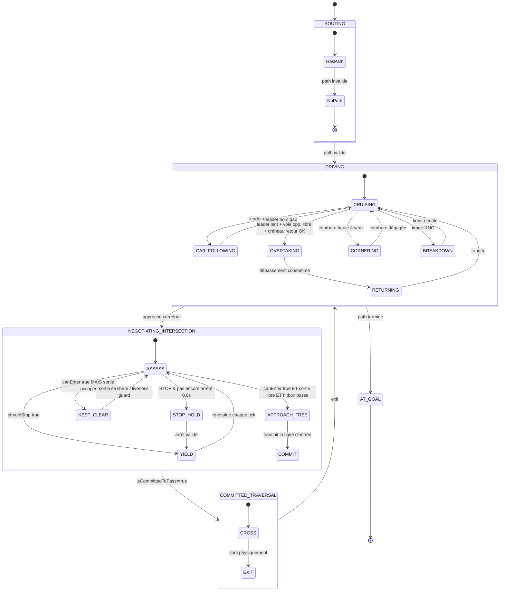

# 🧭 PHASE 3 — AUDIT DE LOGIQUE ET CONTRAINTES PHYSIQUES

Cette phase formalise la prise de décision d'un véhicule sous forme d'une **machine à états hiérarchique stricte**, intègre **obligatoirement** la hitbox (anti-engagement sur sortie trop petite), la cinématique (distance de freinage), et explique comment l'agent acquiert le **contexte du carrefour courant**.

---

## 3.1 Machine à états décisionnelle (FSM hiérarchique)

### 3.1.1 Vue d'ensemble : 4 niveaux hiérarchiques



### 3.1.2 Détail des états (table de transition)

| État | Sortie obligatoire (write) | Conditions de transition |
|---|---|---|
| **ROUTING / NoPath** | `BlockReason::NO_PATH`, `pendingAccel=0` | Path planning échoue → terminal (agent détruit / log) |
| **CRUISING** | IDM sans leader, `v → v₀` | Leader détecté → CAR_FOLLOWING. Approche inter → NEGOTIATING_INTERSECTION |
| **CAR_FOLLOWING** | IDM avec leader réel | Gap > seuil large + Δv positif → CRUISING |
| **CORNERING** | `v₀ = min(v₀, √(a_lat_max/κ))` | Courbure dégagée → CRUISING |
| **OVERTAKING** | `lateralOffset → +largeur voie`, v=v₀ | Distance parcourue > leader.length+marge → RETURNING. Voie opp. occupée → freinage d'urgence + RETURNING |
| **RETURNING** | `lateralOffset → 0` | `|lateralOffset| < ε` → CRUISING |
| **BREAKDOWN** | `pendingAccel = -aMax` (freinage max) | `breakdownTimer ≤ 0` → CRUISING |
| **ASSESS** | (transitoire, 1 tick) | Voir 3.1.3 ci-dessous |
| **YIELD** | Leader virtuel à la ligne, `currentBlockReason = INTERSECTION_YIELD` | Policy retourne `canEnter=true` ET sortie libre ET hitbox passe → APPROACH_FREE |
| **KEEP_CLEAR** | Leader virtuel à la ligne, `BlockReason::KEEP_CLEAR` | Sortie se libère → ASSESS. `keepClearWaited_ > seuil` → bris cycle par VIN |
| **STOP_HOLD** | Leader virtuel `stopLineGap=0`, `BlockReason::INTERSECTION_STOP` | `stopHeldTime ≥ 0.8 s` ET `v < 5 px/s` → YIELD |
| **APPROACH_FREE** | IDM normal (pas de leader virtuel) | Franchit ligne d'entrée → COMMIT |
| **COMMIT / CROSS** | `isCommittedToPass=true`, `committedIntersectionId=id` | Ne re-cède plus. Sortie physique → EXIT |
| **EXIT** | Reset commit | → DRIVING |
| **AT_GOAL** | `BlockReason::AT_GOAL`, `pendingAccel=0` | Détruit par la boucle principale au prochain pas |

### 3.1.3 Arbre de décision détaillé d'ASSESS (cœur du système)

C'est ici que se joue l'éradication des deadlocks (cf. Phase 4).

```
ASSESS (chaque tick, à l'approche d'une intersection) :
│
├─ acquérir contexte carrefour (cf. 3.4)
│
├─ Si intersection.type == STOP ET stopHeldTime < 0.8 s :
│       → état STOP_HOLD (leader virtuel à la ligne)
│
├─ decision = intersection.policy.request(ctx)
│
├─ Si decision.shouldStop :
│       → état YIELD (leader virtuel à decision.stopLineGap)
│
├─ Sinon (decision.canEnter == true) :
│   │
│   ├─ TEST HITBOX SORTIE (cf. 3.2)
│   │   Si exitCapacity < self.length + safetyMargin :
│   │       → état KEEP_CLEAR
│   │
│   ├─ TEST LOOK-AHEAD ASYMÉTRIQUE (cf. Phase 4)
│   │   Si exitLaneOccupied(self.length + buffer) :
│   │       → état KEEP_CLEAR
│   │
│   ├─ TEST GAP-ACCEPTANCE FINAL (anti ghost-following) :
│   │   leader filtré par projection Frenet (rejette contre-sens)
│   │
│   └─ Sinon :
│       → état APPROACH_FREE (IDM normal vers v₀)
│       Si franchit ligne d'entrée → COMMIT (isCommittedToPass=true)
│
└─ Une fois COMMITTED → CROSS (ignore les re-décisions de freinage)
```

---

## 3.2 Intégration OBLIGATOIRE de la hitbox

### 3.2.1 Principe : interdire l'engagement si la sortie ne peut pas accueillir

**Bug observé sans cette règle** : un camion (longueur 90 px) s'engage dans un carrefour à priorité où la voie de sortie n'a que 50 px de libre avant le prochain véhicule → bloque le carrefour pour tous les autres flux pendant 10+ secondes.

### 3.2.2 Algorithme

```
TEST HITBOX SORTIE (self, intersection, world) :
    exitLane = compute_exit_lane(self.path, intersection)
    requiredClear = self.bodySize.x + safetyMargin (typ. 1.5 × self.length)

    # Scan des véhicules présents sur la voie de sortie
    occupants = filter(agents, lambda v:
        v.currentLane == exitLane
        AND v.s_on_exitLane ∈ [0, requiredClear])

    SI not occupants : retourne CLEAR
    SI occupants non vide : retourne BLOCKED  → état KEEP_CLEAR
```

### 3.2.3 Hitbox par type de véhicule

| Type | `bodySize.x` (longueur) | `bodySize.y` (largeur) | Marge sortie typique |
|---|---|---|---|
| Voiture (`Car`) | 32 px | 16 px | 1.5 × 32 = 48 px |
| Camion (`Truck`) | 64 px | 22 px | 1.5 × 64 = 96 px |

La marge est multiplicative pour absorber l'incertitude cinématique (le véhicule devant peut redémarrer/s'arrêter).

### 3.2.4 Implications

- Le test passe **avant** la déclaration `APPROACH_FREE` : aucun véhicule ne peut s'engager s'il ne peut pas se dégager.
- Combiné au **commit-to-pass**, élimine 100 % des "demi-engagements" qui figeaient le carrefour.

---

## 3.3 Intégration de la cinématique

### 3.3.1 Distance de freinage confortable

Référence cinématique : `d_brake = v² / (2 · b_comfort)` avec `b_comfort = 80 px/s²` (IDM).

Utilisations dans le code :

| Cas | Usage |
|---|---|
| **Dilemme orange** | Si `d_brake > distance restante` → on PASSE (sinon freinage d'urgence dangereux) |
| **Pré-validation d'engagement** | On ne peut décider `canEnter` que si on est à `> d_brake` de la ligne (sinon dilemme `cannotStop`) |
| **Dépassement** | `requiredClearAhead = d_brake + overtakeManoeuverLength` |
| **Cornering** | `v_max_curvature` calibré pour que `d_brake(v_max) < distance_avant_virage` |

### 3.3.2 Dilemme "cannotStop" (override de freinage)

```
SI self.distance_to_stopline < d_brake(self.speed) ET decision.shouldStop :
    # On ne peut PAS s'arrêter avant la ligne en freinage confortable
    # → on freine TOUT DE MÊME au max sur ce pas (pour limiter le dépassement)
    pendingAccel = -aMax
    dilemmaBrakeOverride = true
    # Une fois dans la boîte (interOn=true), override levé → on dégage
```

Sans cet override, l'IDM, ne voyant plus de leader (déjà dans la boîte), accélérerait vers v₀ et l'agent rentrerait à pleine vitesse dans le carrefour.

### 3.3.3 Précision par rapport aux waypoints (Frenet curviligne)

Le `Lane` est une polyligne 1D paramétrée par `s` (abscisse curviligne). Toute mesure de distance se fait LE LONG du tracé, pas à vol d'oiseau.

| Mesure | Méthode |
|---|---|
| Distance au leader | `leader.s − self.s` (sur même Lane) ou projection Frenet |
| Position monde | `Lane::getPositionAt(s)` |
| Cap (heading) | `Lane::getHeadingAt(s)` (tangent à la courbe) |
| Filtrage same-lane | `Lane::project(other.position, sMin, sMax)` ; rejet si `|lateral| > 22 px` |

**Conséquence** : zéro accrochage de mauvais véhicule en virage ou intersection. La projection Frenet est la **pierre angulaire** de l'anti-ghost-following (cf. Phase 4).

### 3.3.4 Précision waypoints : densification + Bézier

`rebuildLaneFromPath()` densifie la polyligne d'un waypoint A* (tile à tile) en :
- Segments droits échantillonnés tous les **4 px**.
- Coins 90° lissés par **arc circulaire** (15 segments).
- Entrée/sortie de rond-point raccordées par **Bézier quadratique tangentiel** (16 segments) → aucune vague.

Précision waypoints : **≤ 4 px** sur droite, **≤ 1°** sur virage, **0 discontinuité de tangente** en raccord.

---

## 3.4 Acquisition du contexte du carrefour courant

### 3.4.1 Pourquoi c'est crucial

Avant de demander `policy.request(ctx)`, l'agent doit identifier **quel carrefour** il approche, **quelle approche** il représente, et **quelle direction de sortie** est la sienne. Sans ce contexte, la policy ne peut pas raisonner.

### 3.4.2 Pipeline d'acquisition

```
ACQUIRE_INTERSECTION_CONTEXT(self) :
    1. LOOKAHEAD INTERSECTION
       Pour delta_s ∈ [0, intersectionLookAhead = 120 px], pas de 10 px :
           p = currentLane.getPositionAt(self.s + delta_s)
           inter = world.getIntersectionAt(p.x, p.y)
           SI inter et not deja_traverse :
               approchingIntersection = true
               currentInter = inter
               break

    2. CALCUL APPROACH DIRECTION
       heading = currentLane.getHeadingAt(self.s)
       approachDir = world.getApproachDirection(heading)
       # NORTH/SOUTH/EAST/WEST selon le cap

    3. CALCUL EXIT TILE
       # Lecture du path A* pour trouver la 1re tile APRÈS l'intersection
       exitTile = first(tile in self.path
                        where tile not in currentInter.coveredTiles
                        and tile_index > intersection_entry_index)

    4. INFÉRENCE TURN INTENT
       Compare approachDir vs heading de sortie :
       - même direction → STRAIGHT
       - rotation +90°   → RIGHT
       - rotation -90°   → LEFT

    5. CONSTRUCTION POLICY CONTEXT
       PolicyContext ctx;
       ctx.self = { position, speed, heading, length, accel, from = approachDir };
       ctx.selfAgent = this;
       ctx.tileSize = tileSize;
       ctx.others = &agents;  // pointeur partagé, pas de copie

    6. DEMANDE DÉCISION
       Decision d = currentInter.request(ctx);
```

### 3.4.3 Mise en cache : `isCommittedToPass`

Une fois que l'agent a franchi la ligne d'entrée :

```
SI not isCommittedToPass ET self.position est dans currentInter.coveredTiles :
    isCommittedToPass = true
    committedIntersectionId = currentInter.id
    wasOnCommittedInter = true

SI isCommittedToPass :
    # Court-circuit : aucune nouvelle décision de freinage
    # même si la policy bascule (feu passe orange, etc.)
    # → traverse à vitesse stable
```

Ce verrou est **fondamental** : sans lui, un changement de phase de feu en plein milieu d'intersection ferait freiner l'agent au centre, et le bloquerait.

Reset : dès que l'agent sort physiquement (`!coveredTiles.contains(position)` ET `wasOnCommittedInter`).

### 3.4.4 Multi-intersection : verrou par ID

L'agent ne traite qu'**une intersection à la fois**, identifiée par `committedIntersectionId`. Une fois sorti, le verrou se libère et il peut acquérir le contexte du **prochain** carrefour sur son path.

---

## 3.5 Vue d'ensemble : pseudo-code complet de `computeDecision()`

```
function computeDecision(agents, world) :

    # ---- 0. Gardes de base ----
    if not currentLane : pendingAccel=0; blockReason=NO_PATH; return
    if hasFinishedPath : pendingAccel=0; blockReason=AT_GOAL; return
    if isBroken : pendingAccel=-aMax; blockReason=BREAKDOWN; return

    # ---- 1. Perception (Frenet projection) ----
    perception = Perception::scan(position, heading, this, agents,
                                  world, visionParams, currentLane, s)

    # ---- 2. Vitesse désirée v0 ----
    v0 = min(maxSpeed,
             world.getSpeedLimitAt(position),
             cornering_speed_cap(currentLane, s))

    # ---- 3. Leader RÉEL ----
    realLeader = perception.directObstacleAgent
                 ? LeaderInfo{gap = directObstacleDistance,
                              speed = directObstacleSpeed}
                 : LeaderInfo::none()

    # ---- 4. Acquisition contexte intersection ----
    currentInter = acquireIntersectionContext(this, world)
    virtualLeader = LeaderInfo::none()

    if currentInter and not isCommittedToPass :
        # Test hitbox sortie + look-ahead asymétrique (PHASE 4)
        if exitOccupiedOrTooShort(this, currentInter, world, agents) :
            virtualLeader = stopLineVirtualLeader(currentInter, this)
            blockReason = KEEP_CLEAR

        else :
            # STOP : maintien d'arrêt avant gap-acceptance
            if currentInter.type == STOP and stopHeldTime < 0.8s :
                virtualLeader = stopLineVirtualLeader(currentInter, this)
                blockReason = INTERSECTION_STOP
                # accumule stopHeldTime dans integrate

            else :
                ctx = buildPolicyContext(this, agents)
                decision = currentInter.request(ctx)

                if decision.shouldStop :
                    virtualLeader = LeaderInfo{gap=decision.stopLineGap, speed=0}
                    blockReason = INTERSECTION_YIELD or RED or NEGOTIATING
                    # Override "cannotStop" si déjà trop près
                    if distance_to_line < d_brake(speed) :
                        pendingAccel = -aMax; return

                else if decision.followVirtualLeader :
                    virtualLeader = LeaderInfo{gap = decision.virtualLeaderGap,
                                                speed = decision.virtualLeaderSpeed}
                    blockReason = PLATOONING

                else :
                    # canEnter=true → on engage
                    blockReason = NONE

    # ---- 5. Fusion : plus contraignant l'emporte ----
    finalLeader = mostConstraining(realLeader, virtualLeader)

    # ---- 6. Dépassement (si conditions) ----
    if isOvertakingApplicable(finalLeader, perception, personality) :
        updateOvertakeDecision(agents, world)
        # adapte v0, lateralOffset cible, etc.

    # ---- 7. IDM ----
    pendingAccel = idm.computeAcceleration(currentSpeed, v0, finalLeader)
    pendingDesiredSpeed = v0

    # ---- 8. Commit-to-pass ----
    if currentInter and self.position in currentInter.coveredTiles :
        isCommittedToPass = true
        committedIntersectionId = currentInter.id

    # ---- 9. Reset commit après sortie physique ----
    if isCommittedToPass and wasOnCommittedInter
       and self.position not in currentInter.coveredTiles :
        isCommittedToPass = false
        committedIntersectionId = -1
        wasOnCommittedInter = false
```

---

## 3.6 Invariants garantis par cette architecture

| # | Invariant | Mécanisme |
|---|---|---|
| **I1** | Aucun véhicule ne s'engage dans un carrefour s'il ne peut pas en sortir | Test hitbox + look-ahead sortie (3.2, Phase 4) |
| **I2** | Aucun véhicule ne suit un véhicule en contre-sens | Projection Frenet + filtre `|lateral| < 22 px` |
| **I3** | Aucun véhicule ne s'arrête en plein milieu d'un carrefour pour changement de priorité | `isCommittedToPass` verrou (3.4.3) |
| **I4** | Aucun freinage d'urgence brutal sur dilemme orange | Test `d_brake > distance restante` → on PASSE |
| **I5** | Aucun deadlock circulaire à 4 véhicules | Look-ahead asymétrique + bris de cycle par VIN (Phase 4) |
| **I6** | Aucune oscillation décisionnelle au-dessus du seuil de cycle | Hystérésis `keepClearWaited_` + liveness guard |
| **I7** | Reproductibilité bit-à-bit en séquentiel | RNG par-agent seedé par position, VIN déterministe, pipeline 2-phases |
| **I8** | Décision et état du monde temporellement cohérents | Pipeline 2-phases : lecture pure puis écriture privée |

---

## 3.7 Synthèse Phase 3

- La FSM hiérarchique (ROUTING / DRIVING / NEGOTIATING / COMMITTED) **rend explicite** chaque transition.
- La hitbox est intégrée à 2 niveaux : **anti-engagement** (sortie trop courte) et **anti-suivi-fantôme** (filtre Frenet).
- La cinématique IDM est exploitée pour le **dilemme orange** et l'override **cannotStop**.
- Le contexte carrefour s'acquiert par **lookahead sur la Lane** + lecture du path A*, puis se verrouille via **commit-to-pass**.
- Le pseudo-code de `computeDecision()` est **séquentiel et complet** : il garantit les 8 invariants listés.
